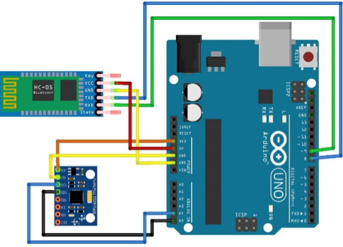

# WatchOut Readme

WatchOut, an Android application to detect terrain change using pedestrian behaviors (Go up/down ramp, step off/on, walk on flat, turn) prediction. Paper [WATCHOUT: A Practical Secure Pedestrian Warning System based on Smartphones](https://ieeexplore.ieee.org/abstract/document/9014250) is publish in [Globecom 2019](https://globecom2019.ieee-globecom.org/) 

------

[TOC]

------

## Matlab Code

Matlab code is in the 'Matlab' folder. It contains the main data processing and evaluation. 

- **Move files in 'Figure' folder and 'Train' folder into 'Matlab' (their parent folder) to work**
- **The data is stored in 'Matlab/MobilePhoneSensor/' folder.** 
- **Row data in zip file 'Matlab/MobilePhoneSensor/{PhoneType}/{User}.zip' need to be unfolded in order to be read by MATLAB** (zip in order to save space)

The structure of the code is: 

### main1: AndroidStepEvaluation

The file 'Matlab/AndroidStepEvaluate201806071108_Orm201807291429.m' is the main code of detection, which reads the text file in 'Matlab/MobilePhoneSensor/{PhoneType}/{User}' directory that the user collected in Actual street. It needs classifier generated in [**Train**](#Train) and saves the result in *ResultPath*. It's subsidiary files are:

- GenerateGroundTruth_Orm201807272112.m
- getEntropy.m

### main2: LookUp_Evaluation

The file 'Matlab/LookUp_Evaluation_Orm20180727.m' is the main code for processing **foot mounted** data the user collected in Actual street. It read the file in the same directory as **main1** and process it and the algorithm refers to [***LookUp***][1]. The variable *EntranceDis* store the result of it. It's subsidiary files are: 

- GenerateGroundTruth_Orm201807272112.m
- IMU.m

### main3: Training for WatchOut {#Train}

In the folder 'Matlab/Train', three files 'WatchOut_Train_{ClassifierType}.m' are the same except the classification part. They generate the classifier stored in 'SVM\_+DateTime.m'. It reads the data files in 'Matlab/MobilePhoneSensor/{PhoneType}/{User}/' UpRamp, DownRamp and Flat. Then processes data, extracts features, trains and evaluates the performance. It also need 'GenerateGroundTruth_Orm201807272112.m'

### 4: Others

Files in 'Matlab/Figures' draw the figures according to the results. Most are depended on 'EvaluateWatchOut.m' in the same folder. The remaining '\*.mat' files are the result of data files. File 'Matlab/Other/SVMParameter_MATLAB_TO_DAT.m' transfer classifier parameters (not only SVM) to a text file which is used to predict in the APP. 

[1] https://www.maozhitang.net/wp-content/uploads/2018/10/paper2.pdf

------

## Android Code

The only folder in 'AndroidApp' is 'LookUpMobile', our android application. This application is written in **Android studioTM** and includes the compiled files. 

- It collects data of accelerometer, gyroscope, and magnetometer in the smartphone and processes it, including segmentation, feature extraction, classification, and warning. 
- With Bluetooth connection to foot-mounted sensors, it also collects and segments the data according to walk cycles. 

## Arduino Code

The foot-mounted sensor is based on Arduino UNO R3, equipped with MPU9150 and HC-05 Bluetooth. The only file 'MPU9150.ino' is the Arduino code. 

- It collects data of accelerometer, gyroscope, and magnetometer in MPU9150 and sends it via Bluetooth every 17ms(70Hz). 
- 